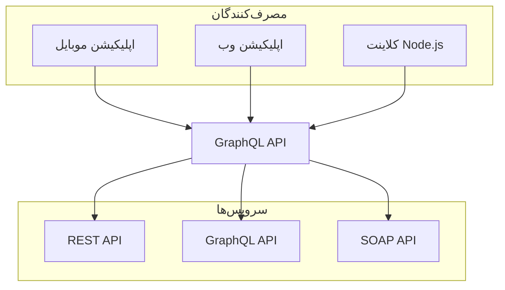

import { Tabs, Tab } from "nextra/components";
import Image from "next/image";

# نصب Tailwind CSS با Next.js

راه‌اندازی Tailwind CSS در یک پروژه Next.js.

<Tabs items={["مرحله ۱", "مرحله ۲","مرحله ۳"]}>
  <Tab>
    ### مرحله ۱: ایجاد پروژه
    با ایجاد یک پروژه جدید Next.js شروع کنید (اگر قبلاً یکی ندارید). رایج‌ترین روش استفاده از Create Next App است.

```bash copy filename=">Terminal"
npx create-next-app@latest my-project --typescript --eslint
cd my-project
```

  </Tab>
  <Tab>
  ### نصب Tailwind CSS 
  Tailwind CSS و وابستگی‌های آن را از طریق npm نصب کنید، و سپس دستور init را اجرا کنید تا فایل‌های `tailwind.config.js` و `postcss.config.js` ایجاد شوند.

```bash copy filename=">Terminal"
npm install -D tailwindcss postcss autoprefixer
npx tailwindcss init -p
```

  </Tab>

  <Tab>
  ### پیکربندی مسیرهای قالب
  مسیر تمام فایل‌های قالب خود را در فایل `tailwind.config.js` اضافه کنید.

```js copy filename="tailwind.config.js"
/** @type {import('tailwindcss').Config} */
module.exports = {
  content: [
    "./app/**/*.{js,ts,jsx,tsx,mdx}",
    "./pages/**/*.{js,ts,jsx,tsx,mdx}",
    "./components/**/*.{js,ts,jsx,tsx,mdx}",

    // یا اگر از پوشه `src` استفاده می‌کنید:
    "./src/**/*.{js,ts,jsx,tsx,mdx}",
  ],
  theme: {
    extend: {},
  },
  plugins: [],
};
```

  </Tab>
</Tabs>


{/* <Image src="/thumbnail.png" alt="توضیحات" width={500} height={300} /> */}

<iframe
  width="100%"
  height="450"
  src="https://www.youtube.com/embed/cg99WEMNAqc?si=JRw1HseHs48aISCq"
  frameborder="0"
  style={{ marginTop: "60px" }}
  allowfullscreen
></iframe>

import { FileTree } from "nextra/components";

<FileTree>
  <FileTree.Folder name="pages" defaultOpen>
    <FileTree.File name="index.md" />
    <FileTree.File name="about.md" />
    <FileTree.Folder name="docs">
      <FileTree.File name="getting-started.md" />
    </FileTree.Folder>
  </FileTree.Folder>
</FileTree>

import { Steps } from "nextra/components";

<Steps>
  ### مرحله ۱
  اول این کار را انجام دهید
  این محتوای مرحله ۱ است

### مرحله ۲
سپس این کار را انجام دهید
این محتوای مرحله ۲ است

### مرحله ۳
در نهایت
این محتوای مرحله ۳ است

</Steps>

<Tabs items={["تب ۱", "تب ۲"]}>
  <Tab>محتوای تب ۱</Tab>
  <Tab>محتوای تب ۲</Tab>
</Tabs>

import { Card, Cards } from "nextra/components";

<Cards>
  <Card title="کارت ۱" href="/link1">
    توضیحات برای کارت ۱
  </Card>
  <Card title="کارت ۲" href="/link2">
    توضیحات برای کارت ۲
  </Card>
</Cards>

## نمودار Mermaid


